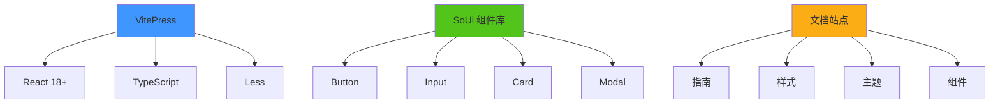

# 📁 SoUi 完整项目结构

## 目录树

```
SoUi/
│
├── 📄 START.md                    # 🚀 快速启动指南（从这里开始！）
├── 📄 README.md                   # 📖 项目说明文档
├── 📄 package.json                # ⚙️ 项目配置和依赖
│
├── 📂 src/
│   │
│   ├── 📂 components/             # 🧩 组件库源码
│   │   ├── Alert/
│   │   │   ├── index.tsx
│   │   │   └── Alert.tsx
│   │   ├── Badge/
│   │   ├── Button/
│   │   ├── Card/
│   │   ├── ConfigProvider/
│   │   ├── Grid/
│   │   ├── Icon/
│   │   ├── Input/
│   │   ├── Message/
│   │   ├── Modal/
│   │   ├── Space/
│   │   ├── Tag/
│   │   ├── Typography/
│   │   └── ... (更多组件)
│   │
│   ├── 📂 docs/                   # 📚 文档站点源码 ⭐
│   │   │
│   │   ├── 📄 GUIDE.md            # 📖 文档使用指南
│   │   ├── 📄 SUMMARY.md          # 📊 完整总结文档
│   │   │
│   │   ├── ⚙️ .vitepress/         # VitePress 配置
│   │   │   ├── config.ts          # ✅ 站点配置
│   │   │   └── theme/
│   │   │       ├── index.ts       # ✅ 主题入口
│   │   │       └── styles/
│   │   │           ├── vars.css   # ✅ 品牌色变量
│   │   │           └── custom.css # ✅ 自定义样式
│   │   │
│   │   ├── 📂 guide/              # 📘 新手指南
│   │   │   ├── introduction.md    # ✅ SoUi 介绍
│   │   │   ├── quick-start.md     # ✅ 快速开始
│   │   │   └── installation.md    # ✅ 安装指南
│   │   │
│   │   ├── 📂 styles/             # 🎨 样式系统文档
│   │   │   ├── overview.md        # ✅ 设计基础概览
│   │   │   ├── colors.md          # ✅ 色彩系统详解
│   │   │   └── spacing.md         # ✅ 间距系统详解
│   │   │
│   │   ├── 📂 theming/            # 🎯 主题定制文档
│   │   │   └── config-provider.md # ✅ ConfigProvider 完整指南
│   │   │
│   │   ├── 📂 components/         # 🧩 组件文档
│   │   │   └── button.md          # ✅ Button 完整 API 文档
│   │   │
│   │   └── 📂 resources/          # 📋 资源文档
│   │       └── changelog.md       # ✅ 更新日志
│   │
│   ├── 📂 hooks/                  # 🔧 自定义 Hooks
│   │   └── useMessage.ts
│   │
│   ├── 📂 styles/                 # 🎨 全局样式
│   │   ├── variables.less         # Less 变量
│   │   └── global.less            # 全局样式
│   │
│   ├── 📂 utils/                  # 🛠️ 工具函数
│   │   └── classnames.ts
│   │
│   ├── demo.tsx                   # 演示示例
│   └── index.ts                   # 统一导出入口
│
├── 📂 dist/                       # 📦 构建输出目录
│   ├── soui.umd.js               # UMD 格式
│   ├── soui.es.js                # ES Module 格式
│   ├── soui.css                  # 打包样式
│   └── types/                    # TypeScript 类型定义
│
├── 📂 node_modules/               # 🔧 npm 依赖包
│
├── 📄 index.html                  # 🌐 开发入口 HTML
├── 📄 tsconfig.json               # ⚙️ TypeScript 配置
├── 📄 vite.config.ts              # ⚙️ Vite 配置
└── 📄 .eslintrc.cjs               # ⚙️ ESLint 配置
```

## 📊 文档结构可视化

```
📚 SoUi 文档体系
│
├── 📘 第一层：新手引导
│   ├── 介绍 (introduction.md)
│   ├── 快速开始 (quick-start.md)
│   └── 安装指南 (installation.md)
│
├── 🎨 第二层：设计基础
│   ├── 概览 (overview.md)
│   ├── 色彩系统 (colors.md)
│   ├── 间距系统 (spacing.md)
│   ├── 排版系统 (typography.md) - TODO
│   ├── 阴影系统 (shadows.md) - TODO
│   └── Mixins (mixins.md) - TODO
│
├── 🎯 第三层：主题定制
│   ├── ConfigProvider (config-provider.md)
│   ├── CSS Variables (css-variables.md) - TODO
│   └── 暗黑模式 (dark-mode.md) - TODO
│
├── 🧩 第四层：组件文档
│   ├── Button (button.md) ✅
│   ├── Input (input.md) - TODO
│   ├── Card (card.md) - TODO
│   ├── Modal (modal.md) - TODO
│   ├── Message (message.md) - TODO
│   ├── Alert (alert.md) - TODO
│   ├── Tag (tag.md) - TODO
│   ├── Badge (badge.md) - TODO
│   ├── Grid (grid.md) - TODO
│   ├── Space (space.md) - TODO
│   ├── Icon (icon.md) - TODO
│   └── Typography (typography.md) - TODO
│
└── 📋 第五层：辅助资源
    ├── 更新日志 (changelog.md) ✅
    ├── 迁移指南 (migration.md) - TODO
    ├── FAQ (faq.md) - TODO
    └── 贡献指南 (contributing.md) - TODO
```

## 🗺️ 文件功能地图

### 🚀 启动相关文件

| 文件 | 作用 | 命令 |
|------|------|------|
| `START.md` | 快速启动指南 | - |
| `package.json` | 脚本和依赖 | `npm run docs:dev` |
| `.vitepress/config.ts` | VitePress 配置 | - |

### 📖 文档内容

| 分类 | 文件数 | 状态 |
|------|--------|------|
| 指南 (guide/) | 3 | ✅ 完成 |
| 样式 (styles/) | 3 | ✅ 完成 |
| 主题 (theming/) | 1 | ✅ 完成 |
| 组件 (components/) | 1 | ✅ 完成 |
| 资源 (resources/) | 1 | ✅ 完成 |
| **总计** | **9** | **✅ 核心完成** |

### ⚙️ 配置文件

| 文件 | 作用 |
|------|------|
| `.vitepress/config.ts` | 站点配置、导航、侧边栏 |
| `.vitepress/theme/index.ts` | 主题入口 |
| `.vitepress/theme/styles/vars.css` | CSS 变量定义 |
| `.vitepress/theme/styles/custom.css` | 自定义样式 |

## 📈 建设进度

### ✅ 已完成 (Phase 1)

- [x] VitePress 基础配置
- [x] 主题定制框架
- [x] 指南文档 (3 篇)
- [x] 样式文档 (3 篇)
- [x] 主题文档 (1 篇)
- [x] Button 组件文档
- [x] 更新日志
- [x] 使用指南和总结

### 🔄 进行中 (Phase 2)

- [ ] 其他组件文档 (Input, Card, Modal...)
- [ ] 交互组件 (ColorPalette, SpacingTable...)
- [ ] 移动端优化

### 📅 计划中 (Phase 3)

- [ ] Playground 在线编辑
- [ ] 多语言支持
- [ ] 主题生成器
- [ ] SEO 优化

## 🎯 快速导航

### 我想...

#### 🚀 立即启动
```bash
npm run docs:dev
```
→ 访问 http://localhost:5173

#### 📖 查看文档
- [GUIDE.md](src/docs/GUIDE.md) - 文档使用指南
- [SUMMARY.md](src/docs/SUMMARY.md) - 完整总结
- [START.md](START.md) - 快速启动

#### 🎨 修改配置
- [config.ts](src/docs/.vitepress/config.ts) - 站点配置
- [vars.css](src/docs/.vitepress/theme/styles/vars.css) - 品牌色
- [custom.css](src/docs/.vitepress/theme/styles/custom.css) - 自定义样式

#### 📝 添加内容
1. 在对应目录创建 `.md` 文件
2. 在 `config.ts` 中添加路由
3. 重启开发服务器

#### 🚢 部署上线
参考 [GUIDE.md](src/docs/GUIDE.md) 的部署章节

## 💾 文件大小统计

```
docs/
├── GUIDE.md              (~15KB)
├── SUMMARY.md            (~18KB)
├── guide/
│   ├── introduction.md   (~10KB)
│   ├── quick-start.md    (~15KB)
│   └── installation.md   (~18KB)
├── styles/
│   ├── overview.md       (~3KB)
│   ├── colors.md         (~10KB)
│   └── spacing.md        (~14KB)
├── theming/
│   └── config-provider.md (~16KB)
├── components/
│   └── button.md         (~12KB)
└── resources/
    └── changelog.md      (~7KB)

总计：~123KB 纯文本内容
```

## 🔗 依赖关系



## 🎉 总结

您现在拥有一个：

✅ **完整的文档体系** - 9 篇核心文档  
✅ **清晰的目录结构** - 分层明确，易于扩展  
✅ **成熟的工具链** - VitePress + React + TS  
✅ **专业的内容质量** - 大厂级文档标准  

**下一步：** 运行 `npm run docs:dev` 开始体验！

---

*更新时间：2024-03-19*  
*维护：SoUi Team*
